# 脚本程序设计课程项目文档

> 沈枭昂 1652672

## 项目介绍

### 项目地址

项目的源码已经同步至 [GitHub](https://github.com/JoshuaSXA/ScriptProgramDesign) ，并已经发布在服务器上：[iTime](https://www.we-campus.cn/Script/login.html) ，由于未包含注册功能（无法修改昵称和上传头像），头像和昵称可能无法加载。

### 项目概述

本项实现了一个具有扩展功能的ToDos应用，共包含7个页面，前端逻辑主要基于jQuery框架，后端使用PHP+MySQL+Apache+Redis的服务端框架。

包含的主要功能有：

* **用户短信验证快捷登录（login.html）**
* **用户中心系统消息提醒（my.html）**
* **今天待办事项（today.html）**
* **创建待办事项（add.html）**
* **完成、删除待办事项**
* **全部完成、全部删除待办事项**
* **筛选、搜索待办事项（list.html）**
* **撰写、发布日志，日志背景音乐（write.html）**
* **查看日志列表（diary.html）**

项目功能亮点：

* **用户友好、简洁美观的UI，提升用户体验**
* **支持用户用户登录，维护用户隐私**
* **基本功能处增加了动画效果，提高了用户交互体验**
* **新增日志模块，用户可以撰写、发布日志，记录日常**
* **具有完整的服务器后端（PHP实现），和线上版本**
* **支持对每条ToDo事项的搜索（关键字模糊匹配）**
* **支持对所有ToDo的筛选（待完成、在进行、已完成、全部）**
* **基于jQuery实现了日历组件**
* **采用Cookie维护用户登录状态信息**
* **加入了Today ToDos页面，用户可以直观地看到今天的ToDos**

### 项目演示

#### 用户登录界面

用户可以输入手机号进行短信验证登录：

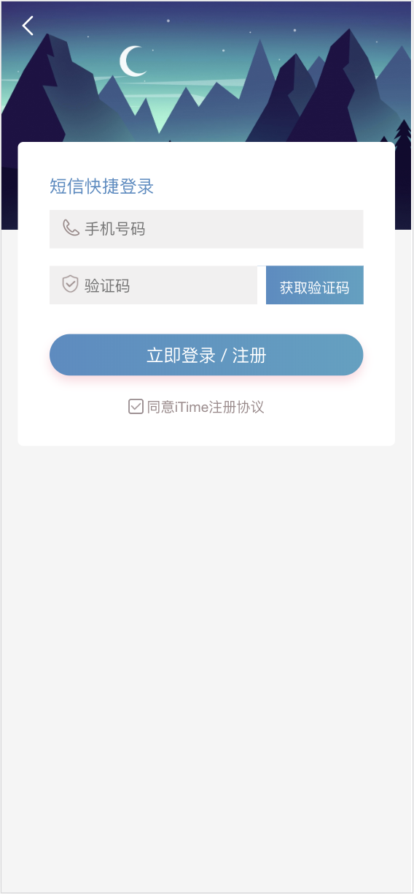

#### 用户个人中心页面

用户登录完成后会自动跳转到个人中心界面

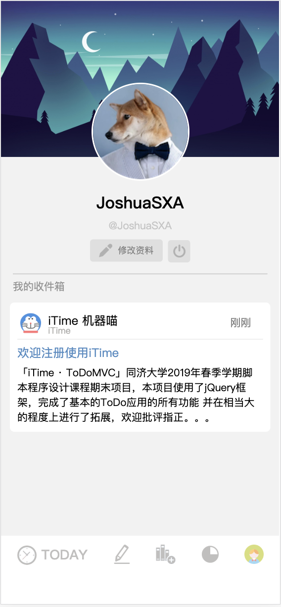

#### 今天待办事项

首页是今天待办事项界面，初始化没有待办事项，用户可以加入

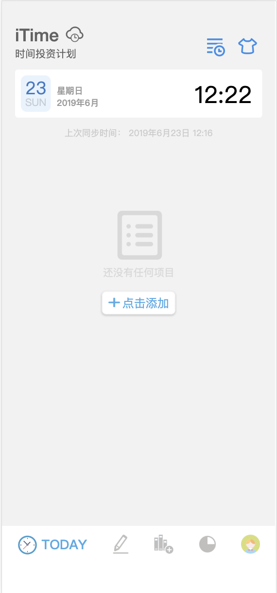

加入事项后，我们可以看到所有的今天待办：

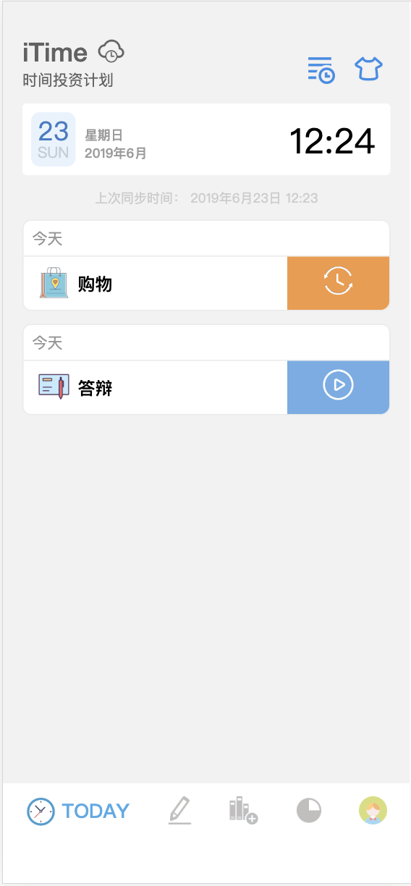

你可以单击右边的蓝色区域来完成该待办事项：

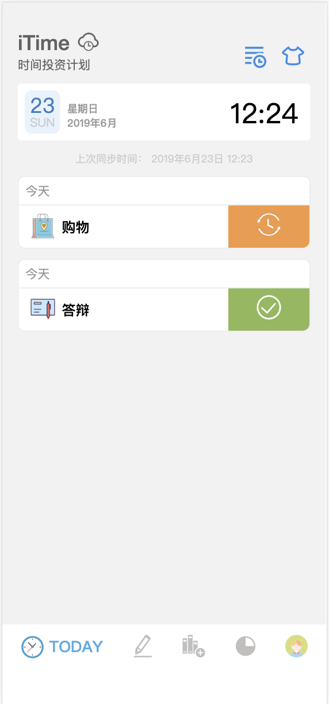

你也可以长按彩色图标区域来删除每个待办事项。其次，你可以点击右上角的icon来唤出全部完成、删除面板：

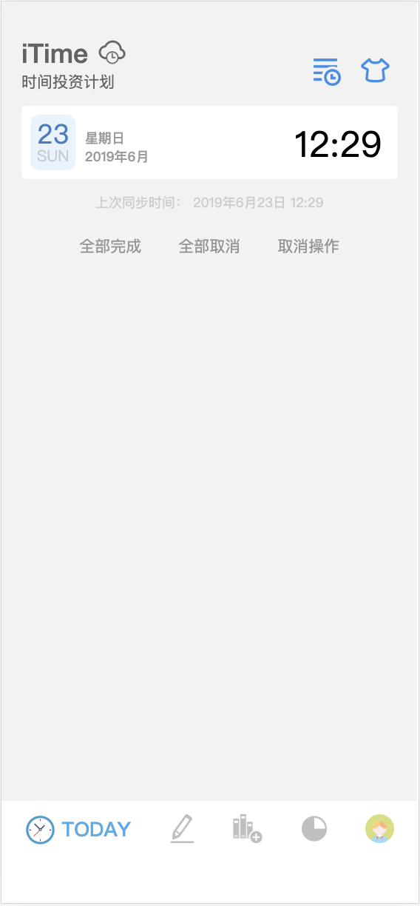

#### 创建待办事项

用户可以输入待办事项的标题，并选择icon

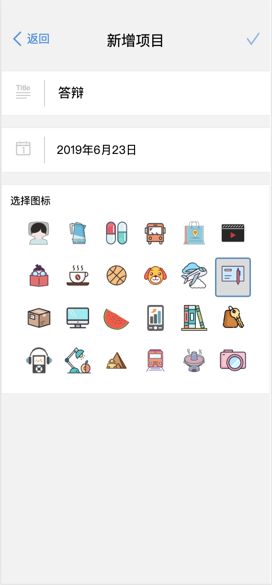

可以点击日期按钮来选择日期：

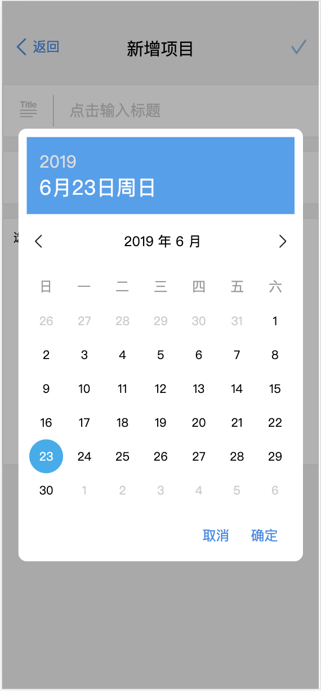

#### 待办事项列表

待办事项列表可以看到所有的待办事项，你可进行关键词搜索

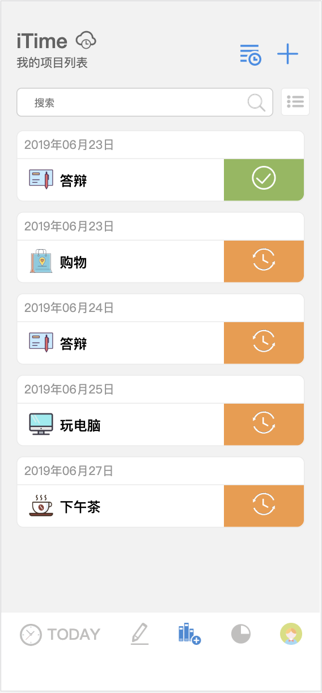

当然你可以点击搜索框右侧的按钮来唤出过滤条件页面：

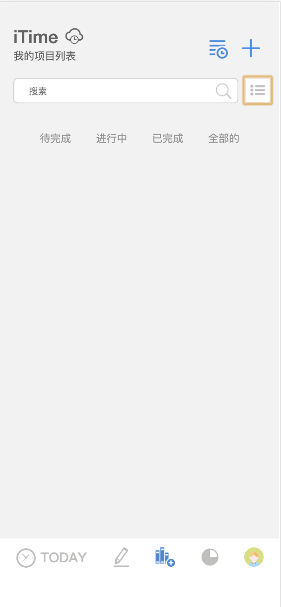

点击相应的条件即可进行过滤

#### 撰写日志页面

用户可以在日志页面撰写日志，日志页面有背景音乐，用户可以选择图标来表示今天的天气，给日志命名，撰写内容。

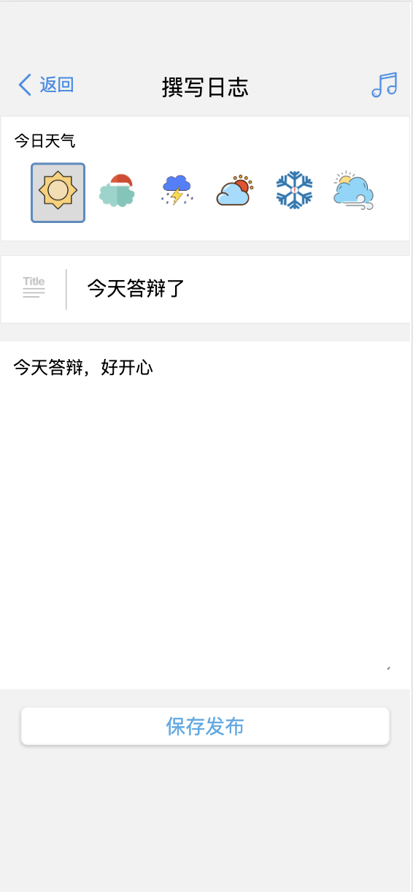

#### 日志列表页面

在日志列表页面，你可以看到自己发布的所有日志：

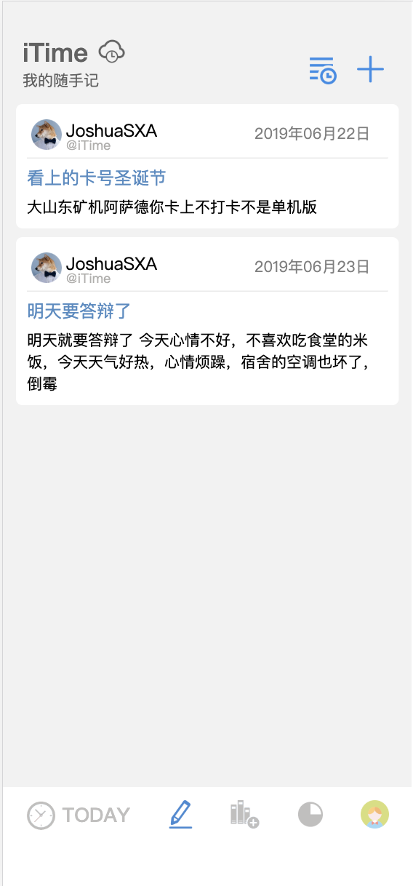

## 项目实现

**项目的源码实现请参考GitHub**